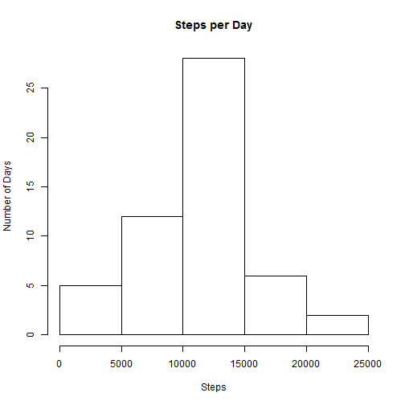
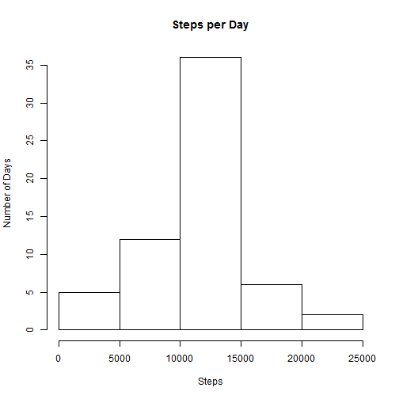

This is an R Markdown document for the Reproducable Research Peer Assignment 1. 

###Loading and processing the Data
*Not much processing was perfomed as the data was fairly clean*


```r
data <- read.csv("activity.csv")
```

###What is mean total number of steps taken per day?
I aggregated the dataset to total steps per day. See the Histogram and Summary of the data. The mean is noted in summary below.


```r
data2 <- aggregate(data$steps, by=list(data$date), FUN = sum)
colnames(data2) <- c("date","steps")
hist(data2$steps, main = "Steps per Day", ylab = "Number of Days", xlab = "Steps")
```

 

```r
summary(data2$steps)
```

```
##    Min. 1st Qu.  Median    Mean 3rd Qu.    Max.    NA's 
##      41    8840   10800   10800   13300   21200       8
```


###What is the average daily activity pattern?
Below is the time series plot of the 5 minute intervals. In this question I omitted the NA's from my dataset. I aggregated the data by interval for plotting. 


```r
clean <- na.omit(data)
data3 <- aggregate(clean$steps, by=list(clean$interval), FUN = mean, na.action = TRUE)
colnames(data3) <- c("interval","steps")
plot(x = data3$interval, y = data3$steps, type = "l", xlab = "Interval", ylab = "Steps")
```

 


Below is code and result for calculating the max

```r
data3[which.max(data3[,2]),1]
```

```
## [1] 835
```

###Imputing missing values
1) Below is the number of missing values in the dataset


```r
length(data$steps) - length(na.omit(data$steps)) 
```

```
## [1] 2304
```

2) Imputting missing values. 
I decided that I would imput the missing values with the the average steps per missing interval. Below is code for performing this. 
I subset dataset into clean (no missing values) and unclean (all missing values). Then I replaced the missing values in the unclean dataset with the average values per interval from my aggregated dataset above. 
Below is the histogram from new dataset.

```r
a <- subset(data, is.na(data$steps))
b <- subset(data, !is.na(data$steps))
id <- match(a$interval, data3$interval)
a[,1] <- data3[id,"steps"] 
data4 <- rbind(a,b)
data5 <- aggregate(data4$steps, by=list(data4$date), FUN = sum)
colnames(data5) <- c("date","steps")
hist(data5$steps, main = "Steps per Day", ylab = "Number of Days", xlab = "Steps")
```

 

Below is comparative mean and median summaries of the original vs. imputed dataset. As you can see, there wasn't much difference using this methodology. 

```r
summary(data5$steps)
```

```
##    Min. 1st Qu.  Median    Mean 3rd Qu.    Max. 
##      41    9820   10800   10800   12800   21200
```

```r
summary(data2$steps)
```

```
##    Min. 1st Qu.  Median    Mean 3rd Qu.    Max.    NA's 
##      41    8840   10800   10800   13300   21200       8
```

###Are there differences in activity patterns between weekdays and weekends?
Below is a summary of weekday vs weekend steps per interval. Not surprisingly, it looks like in general there were more steps per interval on the weekends. Weekdays had more steps per interval in the mornings, which is likely during the morning commute. However, weekends more people would be up and about throughout the entire day.


```r
data4$date <- as.Date(data4$date)
data4[,2] <- weekdays(data4$date)
colnames(data4) <- c("steps","workingday","interval")
## I don't really like looping.. 
data4$workingday[data4$workingday == "Monday"] <- "weekday"  
data4$workingday[data4$workingday == "Tuesday"] <- "weekday"  
data4$workingday[data4$workingday == "Wednesday"] <- "weekday" 
data4$workingday[data4$workingday == "Thursday"] <- "weekday" 
data4$workingday[data4$workingday == "Friday"] <- "weekday" 
data4$workingday[data4$workingday == "Saturday"] <- "weekend"  
data4$workingday[data4$workingday == "Sunday"] <- "weekend"  
data6 <- aggregate(data4$steps, by=list(data4$workingday, data4$interval), FUN = mean)
colnames(data6) <- c("workingday","interval","steps")
library(ggplot2)
g <- ggplot(data6,aes(interval, steps))
g + geom_line(stat = "identity") + facet_grid(. ~ workingday) + facet_wrap(~ workingday, ncol =1) 
```

 

